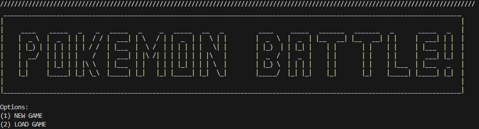
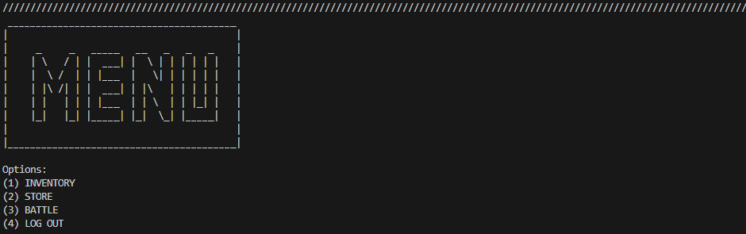
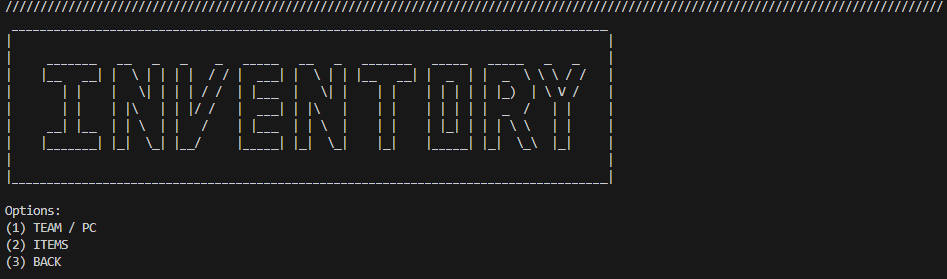
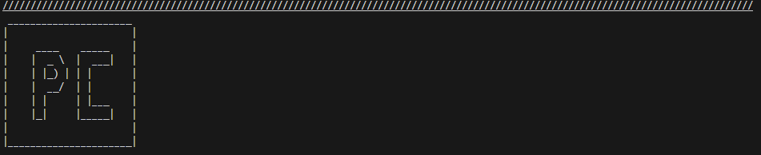
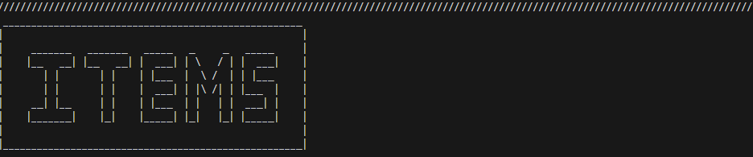
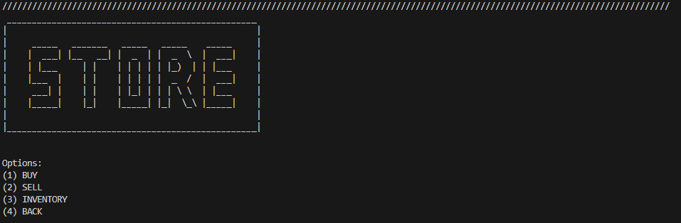
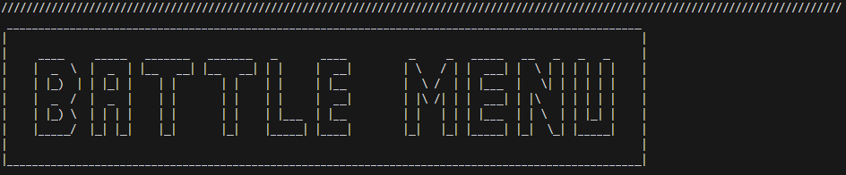
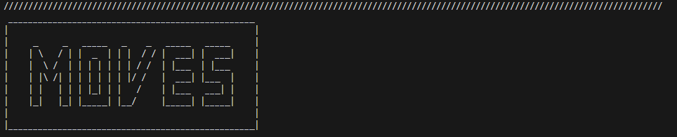
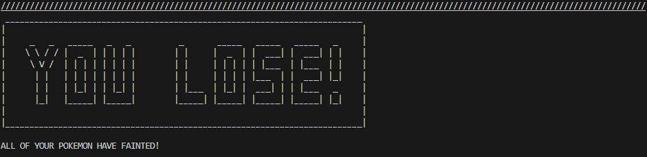
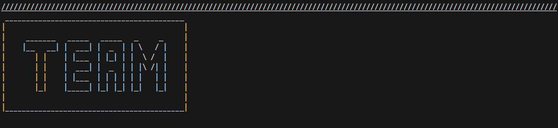

# A Text-Based Role-Playing Game
CO-Authors: [Wesley Wu](https://github.com/xxiyun), [Yubin Zhen](https://github.com/yubinzhen)

## Project Description
In this game, the user can first choose one Pokemon among three to play with, and use their Pokemon to fight and catch other wild Pokemon. Pokemon are associated with different types of types and abilities, and their stats vary by their level. At each step of the game, a narrative is presented and the user can select between different options. The goal of the user is to continually level up their Pokemon through battles with CPUs and eventually catch every Pokemon in this game. 

We are interested in the idea of creating interactive experiences that engage users. An RPG will give us the most creative freedom. We are interested in creating our own turn-based game derived from Pokemon. We will be able to create our own features based on the Pokemon games while also learning how to implement the game mechanics and gameplay experiences that power them. We will also be able to add our own narrative spin on it.

### Language and Tools:
C++\
Visual Studios Code\
Github/Git\
Valgrind\
GDB\
CMake

### Input/Outputs:
Input: All input comes from the user's keyboard, which determines certain actions such as switching between Pokemon, choosing to battle a Pokemon, or selecting options during a battle.\
Output: The output includes updating and displaying the user and CPU Pokemon’s statuses, or the result of a certain action of the user.

### Features:
Battling wild Pokemon with owned Pokemon\
User choice to attack, heal, catch, etc. during battle\
Distinct attack, health, and type stats for each Pokemon\
Experience/leveling and money system\
Able to use/buy items with money earned from battles\
Catch success rate for wild Pokemon varies \
Wild Pokemon appearance/stats scale to the user’s progress\
Wild Pokemon actions are randomized 
Saving and loading game progress

## User Navigation Diagram

### Screen Layouts

## Class Diagram

* Main: Manages the game session, offering a save and load feature. 
* Player: Manages the player's team, money, and experience, as well as interactions with the Inventory and PC.
* Pokemon: Represents basic Pokémon attributes and actions.
* Attack: Represents each attack for Pokemon. Each Pokemon has four abilities. 
* WildPokemon: Extends Pokemon with scaling and random action capabilities.
* Battle: Manages the battle flow, handling player actions and random wild Pokémon responses.
* Inventory: Manages items the player has collected and allows item use as well as purchase and sell items.
* Item: Represents each item in the game, with methods to apply its effect to a Pokemon.
* PokemonSpecies: Represents all Pokemon.
* GrowthRate: Represents how fast the Pokemon level up.
* PokemonType: Represents the Pokemon types.
* moves: Represents the Pokemon moves.

One SOLID principle we applied to the new class diagram was the Single Responsibility. One way we applied it was by removing the feature to access and edit the player’s Pokemon and implementing a separate class, PC, to address that feature. These changes make the code less complex, giving a well-organized, intuitive codebase that allows for better readability.

A second SOLID principle we applied was Liskov Substitution. For example, the StandardBall, GreatBall, and UltraBall subclasses are all coded to be interchangeable as they all have the same functions. These changes allow for code reusability and maintainability along with reducing unexpected bugs caused by inappropriate subclass behavior.

A third SOLID principle we applied to our new class diagram was Interface Segregation Principle (ISP). We applied this principle so users will not be forced to depend on interfaces they don’t use. For example, we created separate interfaces for different concerns. Our inventory class only manages items and money and does not enforce unrelated responsibilities to the class like battling. Our Pokemon class is focused mainly on the Pokemon’s actions and attributes and only our battle class contains battle logic. These changes allowed us to change things easily and made it easier to keep track of things.

 ## Final deliverable
 
 ## Screenshots
 

 ## Installation/Usage
 Our program is terminal based, therefore to play our Pokemon role-playing game, the user will need to run the executable. Users are free to pick any option displayed on the terminal. 
 ## Testing
To test our program, we made unit tests for each function to make sure all our functions worked correctly. We also used valgrind to check for memory allocation.
 
